# Telegram Bot with Database

This is a **Telegram Bot** written in the Python programming language, which supports a database and its main function is to parse the web pages of an online bookstore.

It is easy to use and has simple commands underneath.

## How to find it?
- Link for working with Bot: [t.me/parse14bot](https://t.me/parse14bot)

## Available commands
- ```/parse``` - command that returns five product cards in a single message
- ```/history``` - shows the user's command history 
- ```/help``` - displays the list of available commands
- ```/url``` - returns the link to the website from which the products were taken
## Additional software installation
### Git
- [Git installation guide](https://youtu.be/xiPXztV8WUk?si=Wh9n4y1sA0pyv9mf)
### PostgreSQL
- [Full PostgreSQL installation guide](https://youtu.be/nxGhGQFk34Y?si=RHKnMYhpvTR8VZsm)
### BotFather
Nothing needs to be installed here, this bot is only used to obtain a token:<br>
- [Open BotFather via the link](https://telegram.me/s/BotFther)
- Enter ```/newbot```<br>
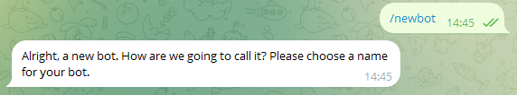
- Set a name for your bot<br>
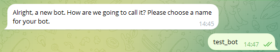
- Copy the token<br>
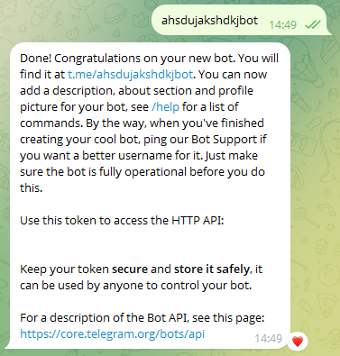
## Bot installation
1) Clone the bot to any convenient location: <br>
   - ```git
     git clone https://github.com/JioSun/TGBotWithDB.git
     ```
     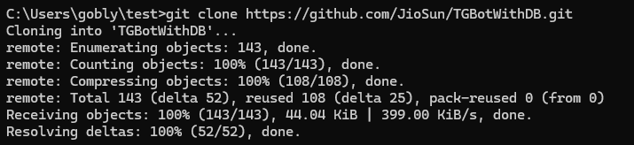
2) Create and activate a virtual environment
   -  ```
      python -m venv venv
      ```
      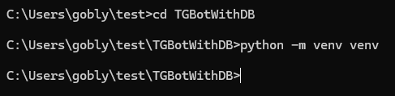
   - ```
     path\to\venv\Scripts\activate
     ```
     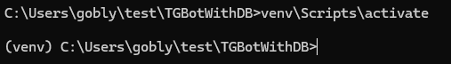
3) In the project root, open a terminal and run:<br>
   - ```
     pip install -r requirements.txt
     ```
4) In the project root, create a file ```.env```, copy the required variables from ```.env.exmaple``` and fill them in:
     ```
     BOT_TOKEN=token received from BotFather
     DB_HOST=database host
     DB_PORT=host port
     DB_NAME=database name
     DB_USER=database username
     DB_PASSWORD=database password
     ```
5) Start the API application (create a local server):<br>
   - ```
     uvicorn api_directory.api_main:app --reload
     ```
     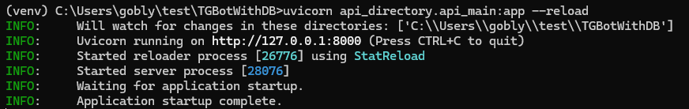
6) Run the bot: <br>
   - ```
     python main.py
     ```
     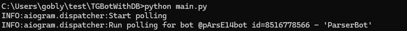
## Examples of bot usage
### Example of /parse command
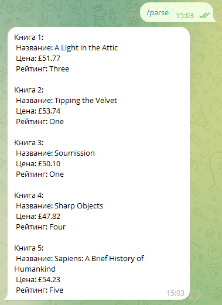
### Example of /history command
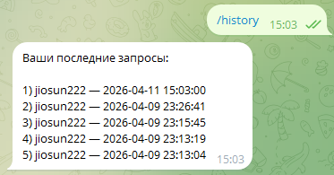
### Example of /url command
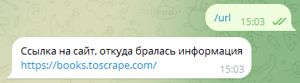
### Example of /help command
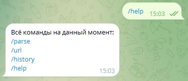


